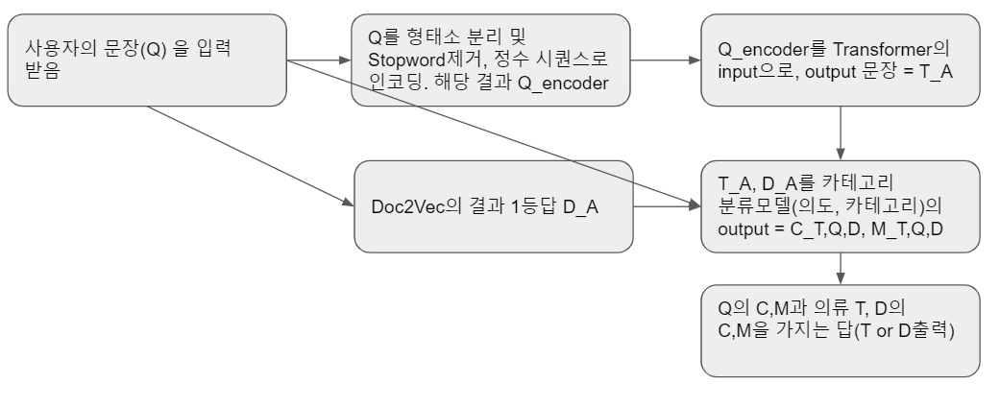

# Subject

의류점에서의 대화 상황을 가지고 학습시킨 챗봇

# Data Set

https://www.aihub.or.kr/aidata/85 - 의류점 데이터 셋

- 사용자의 입력의 의도를 파악하여 그에 따라 시스템이 응답 또는 행동을 하는 대화 생성/관리로 구현
- 대화 데이터의 기본 구조는 Q&A(질의/응답)로 구성되며, 화자가 분리된 각각의 질문(Q)에 대하여 메인 의도(Main Intent)와 서브 의도(Sub Intent)로 구분하여 의도 정보 태깅
- 대화 데이터의 각 문장은 사용자(손님) 질문(Main Question), 메인 질문에 추가적으로 필요한 시스템(점원)의 서브 질문(Sub Question), 서브 질문에 대한 사용자(손님) 응답(User Answer), 시스템(점원) 최종 응답(System Answer)로 구분
- Category : 의류, 신발, 가방, 액세서리

# Model Structure

### Doc2Vec 과 Transformer

## Chatbot flow

# Evaluation

챗봇에 대한 정량적인 성능 평가 기준이 없어 정성적인 평가를 수행

형태소 분석기에 따른 트랜스포머의 성능 평가

4가지 카테고리와 405가지 의도 분류기 정확도 평가

# Conclusion

# References

