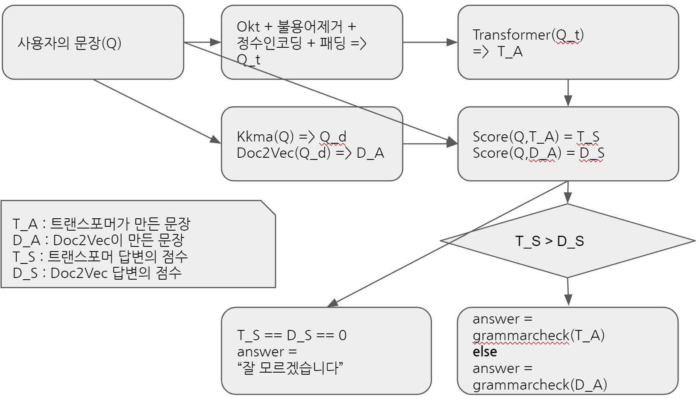
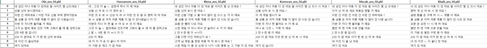
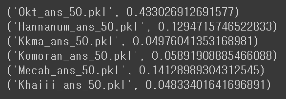

# 의류점 챗봇

- **의류점에서의 고객과 점원사이 가능한 대화 문장으로 학습시킨 챗봇.**
- 고객의 질문 '의도'에 벗어나거나(동문서답), '문법'에 안맞는 답변(ex.'는 네 입니다.') 은 안하는 것을 목표로 개발.
- 광주 인공지능 사관학교 1 기 기업 연계 프로젝트 ([솔트룩스](http://saltlux.com/index.do))
- 만든 이 : 송두기(팀장), [강동구](https://github.com/HERIUN), [박지현](https://github.com/JooEHyeon), 송효준, 김대호

 

## Data Set

https://www.aihub.or.kr/aidata/85 - 의류점 데이터 셋

- 의류가게에서 점원과 고객간 발생할 수 있는 대화 문장 15826개. 문장들은 고객과 점원의 대화 순서대로 기록되며(Train data용), 뒤쪽 925개의 문장은 단순 고객의 문장만 있음(Test data용).
- 원본 데이터는 19개의 columns(ex. SPEAKER, SENTENCE, CATEGORY, MAIN)이 있지만, 이 프로젝트에서는 앞의 예시 4개의 columns만 사용.
- 각 칼럼의 예시. SPEAKER:'고객','점원'   SENTENCE:'이런거 얼마에요?'...   CATEGORY:'신발','의류','가방','액세서리'    MAIN:'제품가격문의'...등의 세부의도 405가지 경우
- 추가적으로 원본데이터에서는 MAIN값이 100개정도 null값이 있어서, 이건 직접 사람이 값을 채워넣음. => wear_MAIN_edited.csv
- 사용자의 입력의 의도를 파악하여 그에 따라 시스템이 응답 또는 행동을 하는 대화 생성/관리로 구현
- 대화 데이터의 기본 구조는 Q&A(질의/응답)로 구성되며, 화자가 분리된 각각의 질문(Q)에 대하여 메인 의도(Main Intent)와 서브 의도(Sub Intent)로 구분하여 의도 정보 태깅
- 대화 데이터의 각 문장은 사용자(손님) 질문(Main Question), 메인 질문에 추가적으로 필요한 시스템(점원)의 서브 질문(Sub Question), 서브 질문에 대한 사용자(손님) 응답(User Answer), 시스템(점원) 최종 응답(System Answer)로 구분
- 자세한 내용은 data_anal.ipynb 참고.

 

## Model Structure

#### Doc2Vec : 답변 예측 모델 - 학습 시킨 문장에 대한 자연스러운 답변을 기대하며 설계
#### Transformer : 답변 예측 모델 - 학습 시키지 않은 자연여 입력에 대해서도 유연한 대처를 위해 설계
#### 분류 모델 2개 : 두 예측 모델이 내놓은 답변의 카테고리와 의도를 예측하여 실제 질문의 의도와 유사한지 판단하여, 더욱 유사한 모델의 답변을 선택

*seq2seq 모델 : 위의 모델이 하나도 포함되지 않은 seq2seq만으로 점원의 답변을 생성 : Seq2Seq_Chatbot_의류.ipynb*

 

## Chatbot flow

 

## Evaluation

챗봇에 대한 정량적인 성능 평가 기준이 없어 정성적인 평가를 수행

형태소 분석기에 따른 트랜스포머의 성능 평가

4가지 카테고리와 405가지 의도 분류기 정확도 평가

 

## Conclusion
기존의 챗봇은 시나리오에 기반하거나 하드코딩을 기반으로 만들어져왔다. 우리 팀은 하드코딩은 최대한 배제하고  AI라는 취지를 살려 챗봇을 개발하기로했다. 
AI 챗봇을 개발하며 한국어가 갖는 특성(교착어, 토큰이 형태소 단위 등등)을 알게되었고, 그로 인한 다양한 변수(형태소 분석기 마다 다른 결과, 어절 단위 입력 음절단위 출력, 맞춤법 교정, 띄어쓰기 교정 등등)를 만날 수 있었다.

또한 모델이 강력하면 전처리에서 많은 시간을 쏟지 않더라도 일정 수준의 이상의 결과를 얻을 수 있음을 알게되었다. 그렇지만 최종적으로 더 높은 수준의 결과를 기대한다면 데이터셋의 가공과 전처리(불필요한 단어의 전처리, 형태소 분석기 튜닝, 사용자 정의 단어 사전 등)와 후처리(CRF 레이어의 추가, 앙상블)에서의 디테일한 고민이 필요하다는 사실 또한 깨닫게되었다.

## How to execute
download models & dictionaries, list : https://drive.google.com/file/d/1AQSWgfNLzba8r6XLTfz5Oi_6vGLu0DYu/view?usp=sharing

unzip and load all file to google drive(optional)

Run final.ipynb

 

## References

https://github.com/deepseasw/seq2seq_chatbot : seq2seq 챗봇 참조  
https://cholol.tistory.com/466?category=80348 : Doc2Vec   
https://nlpinkorean.github.io/illustrated-transformer : 트랜스포머 참조  
https://wikidocs.net/book/2155 : 자연어처리에 대한 전반적인 지식을 학습한 곳.  

